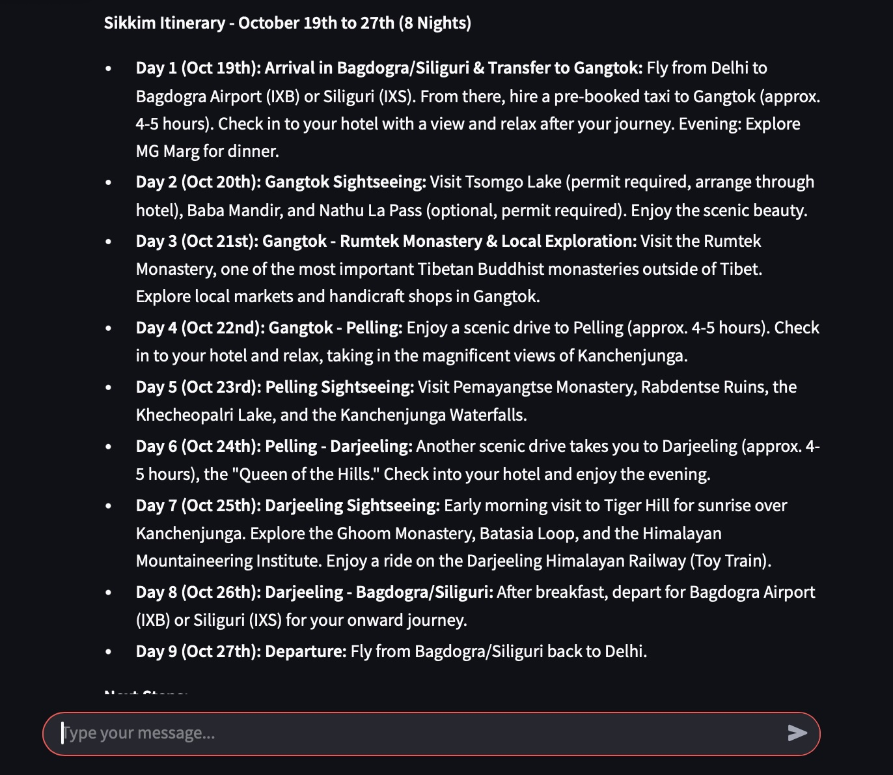

# 🌍 Travel with AI ✈️
**Plan your perfect trip in seconds — powered by AI.**

Travel with AI is a **Streamlit web app** that uses **Gemini 2.5 Pro** and prompt engineering to help you discover destinations, plan itineraries, and get personalized travel suggestions effortlessly.

---

## 🚀 Features
- **AI-Powered Travel Planning** – Just type your preferences, and the AI suggests destinations and activities.
- **Customizable Itineraries** – Fine-tune plans to match your style.
- **Budget-Friendly Suggestions** – Get recommendations that fit your spending.
- **Instant Results** – No complex setup, just open and start exploring.
  
---

## 🛠️ Tech Stack
- **Frontend & Backend:** [Streamlit](https://streamlit.io/)
- **AI Model:** Gemini 2.5 Pro
- **Language:** Python

---

## 📦 Installation

```bash
# 1️⃣ Clone the repository
git clone https://github.com/your-username/travel-with-ai.git

# 2️⃣ Navigate to the project folder
cd travel-with-ai

# 3️⃣ Install dependencies
pip install -r requirements.txt

# 4️⃣ Set up your environment variables
# Add your Gemini API key in a .env file
echo "GEMINI_API_KEY=your_api_key_here" > .env

# 5️⃣ Run the app
streamlit run app.py
```

---

## 📸 Screenshots

*Main interface showing AI-powered travel planning*


*Sample AI-generated travel itinerary*

---

## 🌐 Live Demo
🚀 **[Try it here](https://travelwithai.streamlit.app)**

---

## 📜 License
This project is licensed under the MIT License.
